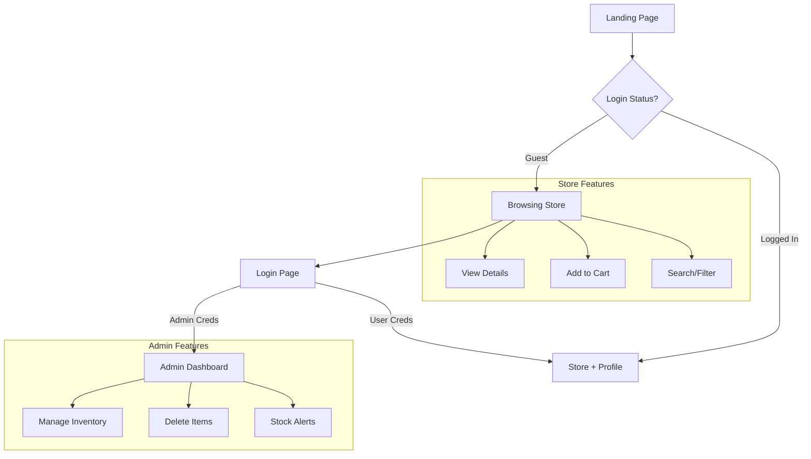
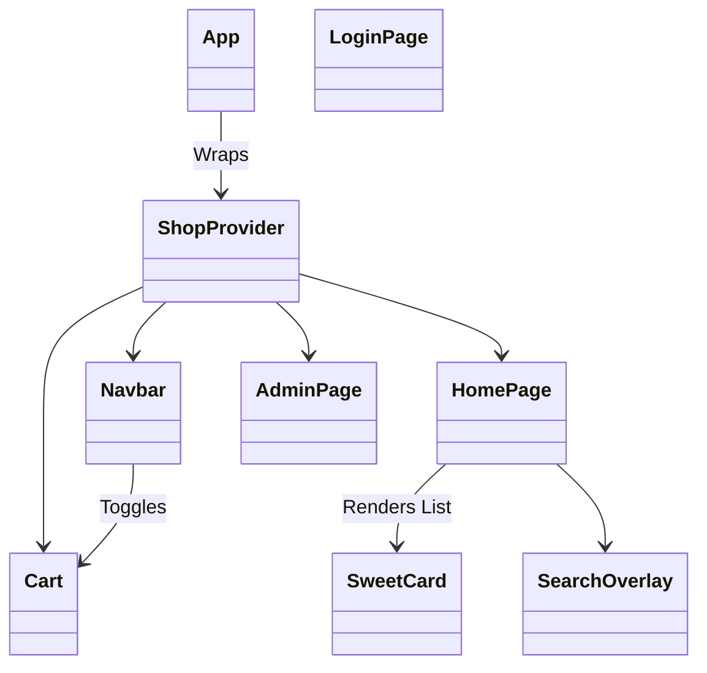

# 🍬 Sweet Shop Management System

A modern, responsive web application for managing a sweet shop inventory and customer storefront. Built with the latest **React 19** ecosystem, featuring dynamic animations, state management, and a clean UI/UX.


---

## 📖 Table of Contents
- [Features](#-features)
- [Technology Stack](#-technology-stack)
- [Application Flow](#-application-flow)
- [Getting Started](#-getting-started)
- [Usage Guide](#-usage-guide)
- [Project Structure](#-project-structure)

## 🚀 Features

### 🛍️ Client Storefront
*   **Product Catalog**: Browse a visually appealing grid of sweets with pricing and stock info.
*   **Smart Filtering**: Filter products by multiple categories (Candy, Chocolate, Hard Sweets).
*   **Search**: Real-time search functionality to find specific treats instantly.
*   **Shopping Cart**: Fully functional cart with add/remove/update quantity features.
*   **Responsive Design**: Mobile-friendly layout for all screen sizes.

### 🛡️ Admin Dashboard
*   **Inventory Overview**: Tabular view of all products with stock levels.
*   **Stock Management**: Visual indicators for low stock (Red < 20 warnings).
*   **Product Management**: Delete products (simulated) and placeholder for edit/add/upload.
*   **Secure Access**: Protected route accessible only via admin login.

### 🔐 Authentication (Mock)
*   **Role-Based Access**: Distinct flows for `Admin` and `User`.
*   **Secure Routing**: Protected routes prevent unauthorized access to admin pages.

---

## 💻 Technology Stack

*   **Frontend Framework**: React 19 (Hooks, Context API)
*   **Build Tool**: Vite (Lightning fast HMR)
*   **Styling**: Tailwind CSS (Utility-first design)
*   **Animations**: Framer Motion (Page transitions, micro-interactions)
*   **Routing**: React Router v7 (Client-side routing)
*   **HTTP Client**: Axios (Ready for backend integration)
*   **Icons**: Heroicons / SVGs

---

## 📊 Application Flow

### User Navigation Flow



### Component Architecture



---

## 🏁 Getting Started

### Prerequisites
*   **Node.js** (v18 or higher recommended)
*   **npm** or **yarn**

### Installation

1.  **Clone the repository**
    ```bash
    git clone https://github.com/yourusername/sweet-shop-management.git
    cd Sweet-Shop-Management-System
    ```

2.  **Install dependencies**
    ```bash
    npm install
    ```

3.  **Start the development server**
    ```bash
    npm run dev
    ```

4.  **Open in browser**
    Navigate to `http://localhost:5173` (or the port shown in your terminal).

---

## 🎮 Usage Guide

Use the following **Mock Credentials** to test the application authentication flows:

| Role | Username | Password | Access |
|------|----------|----------|--------|
| **Admin** | `admin` | `admin` | Full Inventory Control |
| **User** | `user` | `test` | Shopping & Cart |

> **Note**: This application currently runs in **Frontend Mode** using mock data (`src/api/mockData.js`). Data changes (like deletions) will reset upon page refresh.

---

## 📁 Project Structure

```bash
src/
├── api/            # Mock data and API services
├── components/     # Reusable UI components (Navbar, Cart, Cards)
├── context/        # Global State (ShopContext)
├── pages/          # Main Route Pages (Home, Admin, Login)
├── assets/         # Static images/icons
└── main.jsx        # Entry point
```

---

Built with ❤️ by **[Your Name/Team]**
